# EduPulse

Student performance intelligence platform: early-warning risk scoring, cross-subject score prediction, explainable and fairness-audited machine learning, served through a REST API and an interactive dashboard.

[](https://github.com/ZainDev04/edupulse/actions/workflows/ci.yml)
[](pyproject.toml)
[](https://scikit-learn.org)
[](api/main.py)
[](web/)
[](app/dashboard.py)
[](Dockerfile)
[](tests/)
[](pyproject.toml)
[](LICENSE)

## What it does

EduPulse takes the well-known Students Performance dataset (1,000 students, five background attributes, three exam scores) and builds a complete machine learning system around it. A single training command benchmarks ten model families with repeated cross-validation, tunes the winner with Optuna, picks a decision threshold from a recall target, calibrates conformal prediction intervals for the regression task, explains predictions with SHAP, audits subgroup fairness and equalises recall across lunch groups with per-group thresholds, writes a model card, registers the artefacts and records the run in MLflow. A FastAPI service, a Next.js web app and a Streamlit dashboard serve the registered models. Everything is covered by 57 tests and a GitHub Actions workflow.

The project answers three questions:

| Task | Question | Inputs | Kind |
|---|---|---|---|
| `at_risk` | Which students are likely to average below 60, before any exam is taken? | background only | binary classification |
| `math_score` | What math score should we expect, given the reading and writing scores and background? | background + reading + writing | regression |
| `performance_level` | Which tier (low, medium, high) does a student fall into, given all scores? | background + all scores | 3-class classification |

The first task is the point of the project. The third is the original coursework task, kept as a case study in target leakage (see below).

## Results

Hold-out split is 200 students (20%, stratified). Cross-validation is 5-fold with 2 repeats on the 800 training students.

| Task | Best model | CV score | Hold-out |
|---|---|---|---|
| At-risk early warning | Logistic regression (tuned C) | ROC-AUC 0.742 ± 0.034 | ROC-AUC 0.699, PR-AUC 0.519 (prevalence 0.285), recall 0.74 at threshold 0.42 |
| Math-score prediction | Ridge (tuned alpha) | R² 0.867 ± 0.019 | R² 0.882, RMSE 5.36, MAE 4.18; 90% conformal interval (half-width 9.2) covers 88.5% |
| Performance level | HistGradientBoosting (tuned) | macro-F1 0.971 | accuracy 0.985, macro-F1 0.985 |

<details>
<summary>At-risk leaderboard (CV ROC-AUC)</summary>

| Rank | Model | ROC-AUC | std |
|---|---|---|---|
| 1 | logistic_regression | 0.742 | 0.034 |
| 2 | svm_rbf | 0.711 | 0.037 |
| 3 | gradient_boosting | 0.698 | 0.036 |
| 4 | xgboost | 0.683 | 0.035 |
| 5 | hist_gradient_boosting | 0.674 | 0.036 |
| 6 | lightgbm | 0.669 | 0.034 |
| 7 | random_forest | 0.638 | 0.025 |
| 8 | knn | 0.633 | 0.033 |
| 9 | extra_trees | 0.625 | 0.033 |
| 10 | baseline_majority | 0.500 | 0.000 |

With only five categorical inputs (about 17 one-hot columns) there is little non-linear structure to learn, so regularised linear models generalise best and deep trees over-fit.
</details>

<details>
<summary>Math-score leaderboard (CV R²)</summary>

| Rank | Model | R² | std |
|---|---|---|---|
| 1 | ridge | 0.867 | 0.019 |
| 2 | gradient_boosting | 0.846 | 0.025 |
| 3 | xgboost | 0.839 | 0.027 |
| 4 | random_forest | 0.835 | 0.027 |
| 5 | hist_gradient_boosting | 0.834 | 0.022 |
| 6 | lightgbm | 0.827 | 0.026 |
| 7 | extra_trees | 0.826 | 0.029 |
| 8 | svm_rbf | 0.783 | 0.019 |
| 9 | knn | 0.782 | 0.018 |
| 10 | baseline_mean | -0.008 | 0.006 |
</details>

Math-score predictions come with a conformal interval: the 90% quantile of absolute out-of-fold residuals on the 800 training students gives a half-width of 9.2 points, and on the 200 hold-out students the band contains the true score 88.5% of the time, which is within sampling noise of the target. The guarantee is marginal (over students on average), not per student.

The fairness audit shows the cost of a single threshold: it flags 95% of free/reduced-lunch students and catches only 52% of at-risk students on standard lunch. Per-group thresholds chosen on out-of-fold probabilities (0.57 for free/reduced, 0.34 for standard) bring recall to 0.89 and 0.86, cutting the recall gap from 0.447 to 0.031. Overall recall rises from 0.74 to 0.88 and precision from 0.35 to 0.40 while the flagged share moves from 60.5% to 63.0%. The API returns both flags so the choice of threshold stays visible.

What drives the at-risk score, by mean absolute SHAP value: lunch (0.63), test preparation course (0.44), race/ethnicity (0.30), parental education (0.28), gender (0.27). Lunch type is a proxy for household income. Students who completed the test preparation course are at risk 17% of the time against 35% for those who did not.

<table>
<tr>
<td>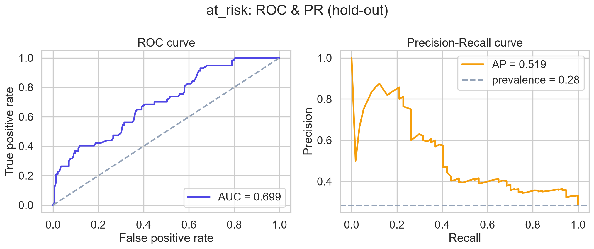</td>
<td>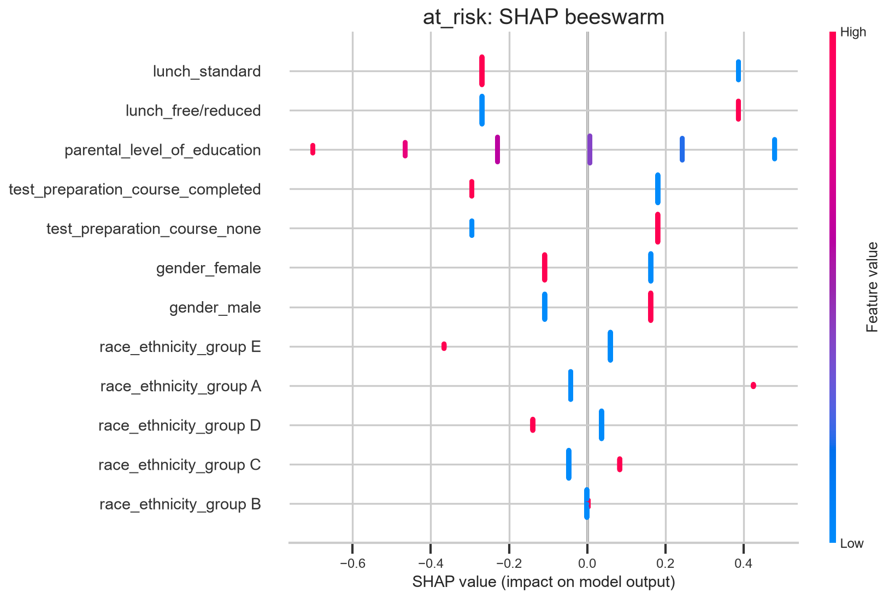</td>
</tr>
<tr>
<td>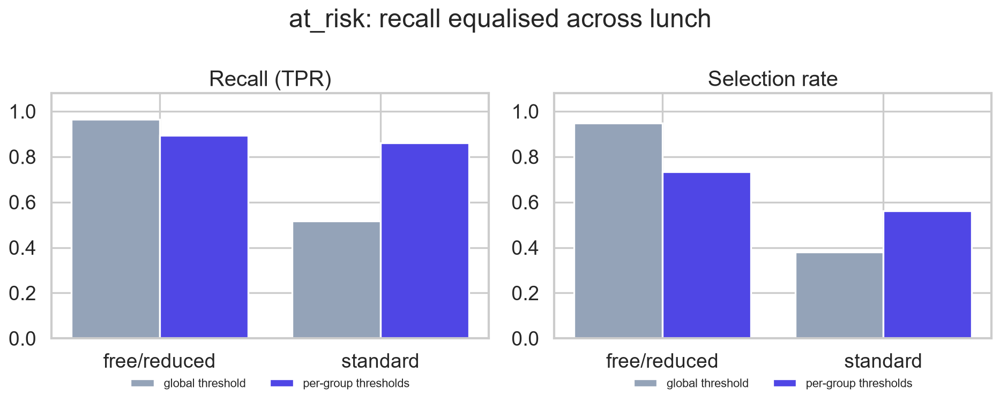</td>
<td>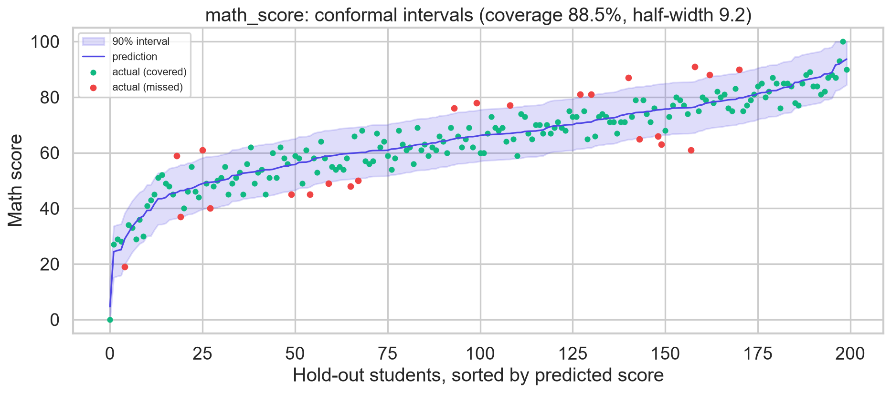</td>
</tr>
</table>

Figures and models are regenerated by `edupulse train --all`.

### The leakage case study

The original coursework predicted `performance_level` from the three exam scores with a random forest and reported about 96% accuracy. The label is defined as the average of the three scores, cut at 60 and 80. Any model just re-learns those two cut-offs, so the accuracy says nothing about generalisation. EduPulse keeps that task (it scores 98.5% on hold-out), documents it as leakage in the task registry and the model card, and reformulates the useful question: can we flag students at risk before any exam, from background alone? That is the `at_risk` task. It is harder, the number is lower, and the number means something.

## Architecture

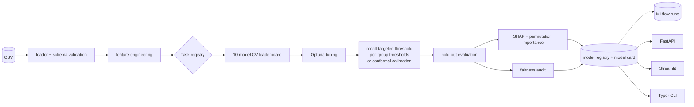

Every persisted model is one `sklearn.Pipeline` (`FeatureEngineer`, then a `ColumnTransformer`, then the estimator), so the API accepts raw JSON and there is no train/serve skew. Design notes are in [`docs/architecture.md`](docs/architecture.md).

## Quick start

```bash
git clone https://github.com/ZainDev04/edupulse.git && cd edupulse
python -m venv .venv && . .venv/bin/activate          # Windows: .venv\Scripts\activate
pip install -r requirements.txt && pip install -e .

edupulse data validate            # schema check on data/raw/StudentsPerformance.csv
edupulse eda                      # EDA figures and statistical profile under reports/
edupulse train --all --trials 50  # leaderboard, Optuna, evaluation, SHAP, fairness, registry
edupulse serve                    # REST API at http://localhost:8000/docs
edupulse dashboard                # Streamlit at http://localhost:8501
edupulse ui                       # MLflow run history at http://localhost:5000
```

<details>
<summary>More commands</summary>

```bash
edupulse train --task at_risk --no-tune --repeats 1   # fast run
edupulse leaderboard --task math_score
edupulse evaluate --task at_risk
edupulse models
edupulse runs --task at_risk                          # MLflow runs, newest first
edupulse train --task at_risk --no-track              # skip MLflow for this run
edupulse predict --task at_risk --gender male --lunch free/reduced --test-preparation-course none --explain
edupulse data profile
```
</details>

### Docker

```bash
docker compose up --build     # trains at build time, then serves the API on :8000, the web app on :3000, Streamlit on :8501 and MLflow on :5000
```

## API

```bash
curl -X POST "http://localhost:8000/predict/at-risk?explain=true" \
  -H "Content-Type: application/json" \
  -d '{"gender":"male","race_ethnicity":"group A","parental_level_of_education":"high school",
       "lunch":"free/reduced","test_preparation_course":"none"}'
```

```json
{
  "probability": 0.885,
  "at_risk": true,
  "threshold": 0.416,
  "risk_band": "critical",
  "model_version": "20260911-223257",
  "explanation": [
    {"feature": "lunch", "value": "free/reduced", "contribution": 0.835},
    {"feature": "race_ethnicity", "value": "group A", "contribution": 0.447},
    {"feature": "test_preparation_course", "value": "none", "contribution": 0.321}
  ]
}
```

| Method | Path | Purpose |
|---|---|---|
| GET | `/health` | liveness and registered model versions |
| GET | `/models`, `/models/{task}` | metadata, metrics, threshold, features |
| GET | `/models/{task}/leaderboard`, `/fairness`, `/importance` | CV leaderboard, subgroup audit, SHAP and permutation importance |
| GET | `/stats` | dataset headline figures and at-risk rate by group |
| POST | `/predict/at-risk` | early-warning probability, risk band, optional SHAP |
| POST | `/predict/math-score` | expected math score |
| POST | `/predict/performance-level` | low, medium or high with class probabilities |
| POST | `/predict/{task}/batch` | up to 1,000 students per call |

Requests are validated with Pydantic `Literal` enums, so an unknown category returns 422. Every response has an `X-Process-Time-ms` header. A missing model returns 503 with a hint on how to train it.

## Web app

A Next.js 16 frontend under [`web/`](web/) built with Tailwind 4, shadcn/ui and Recharts on top of the REST API. Five pages: Overview (KPIs, registered models, risk by group), Predict (form, probability gauge with the decision threshold marked, SHAP contributions), Leaderboard, Explainability and Fairness. Server components read from the API directly; the Predict form goes through a `/api/*` proxy route.

```bash
cd web && npm install
API_URL=http://localhost:8000 npm run dev      # http://localhost:3000, with `edupulse serve` running
```

<table>
<tr>
<td>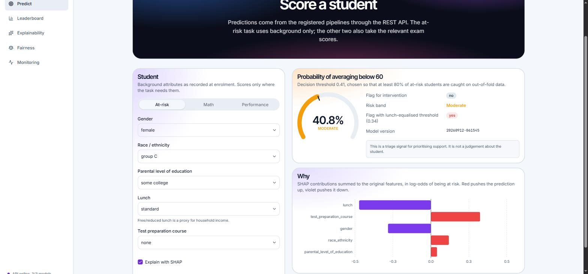</td>
<td>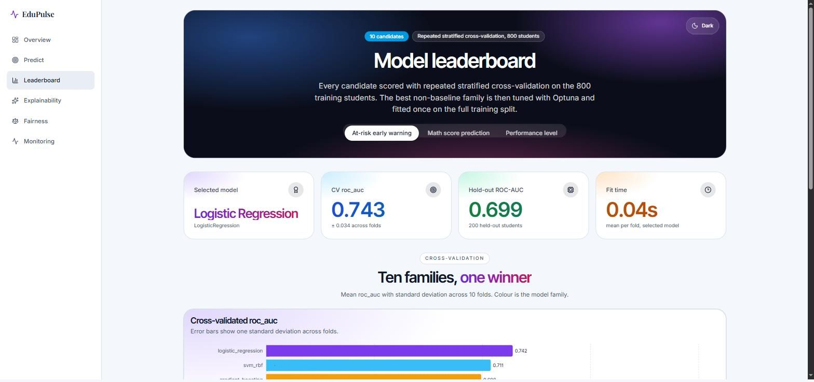</td>
</tr>
</table>

## Streamlit dashboard

An in-process dashboard that uses the same prediction service without an HTTP hop. Six pages: Overview (KPIs and interactive EDA), Leaderboard, Predict, Explainability, Fairness, and Model cards.

<table>
<tr>
<td>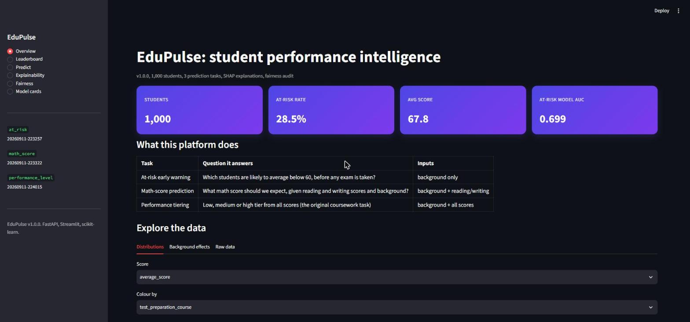</td>
<td>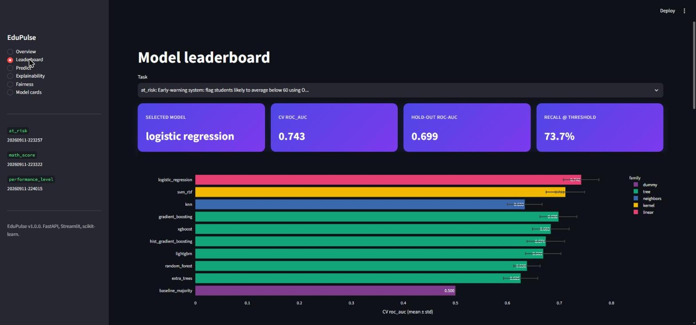</td>
</tr>
<tr>
<td>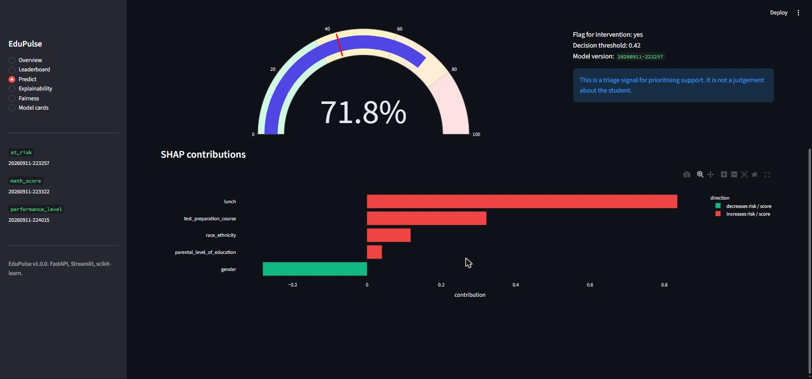</td>
<td>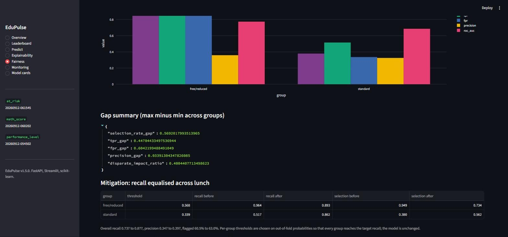</td>
</tr>
</table>

## Experiment tracking

Every training run is recorded in MLflow next to the registry entry it produced: settings, tuned parameters, a CV score per zoo candidate, the Optuna objective per trial, hold-out metrics, fairness gaps, figures, the model card and the fitted pipeline. The registry stays the source of truth for serving; MLflow holds the history so runs can be compared.

```bash
edupulse train --task at_risk --trials 60   # recorded automatically
edupulse runs --task at_risk                # table of runs, newest first
edupulse ui                                 # MLflow UI on http://localhost:5000
```

The store is a SQLite file at `mlruns/mlflow.db` with artefacts under `mlruns/artifacts`. Set `EDUPULSE_TRACKING_URI` to a server URL to share runs, `EDUPULSE_TRACKING=false` (or `--no-track`) to switch tracking off. If `mlflow` is not installed the pipeline logs a warning and carries on.

## Project structure

```
api/main.py                 FastAPI service
web/                        Next.js frontend (Tailwind, shadcn/ui, Recharts)
app/dashboard.py            Streamlit dashboard
src/edupulse/               the library (see docs/architecture.md)
  data/                     loader, schema
  features/                 engineering, preprocessing
  models/                   zoo, train, evaluate, conformal, explain, fairness, mitigation, registry, tracking (MLflow)
  tasks.py                  task registry
  pipeline.py               end-to-end run
  serving.py                prediction service shared by CLI, API and dashboard
  eda.py, cli.py, config.py
notebooks/                  01_eda, 02_modelling, 03_explainability_fairness (generated and executed)
tests/                      57 pytest tests (unit, end-to-end, tracking, conformal, mitigation, API)
scripts/build_notebooks.py  notebooks as code
models/                     versioned artefacts and model cards (generated)
mlruns/                     MLflow store: SQLite database and run artefacts (generated, ignored)
reports/                    figures, EDA profile, summary.json (generated)
docs/architecture.md
Dockerfile, docker-compose.yml, Makefile, .github/workflows/ci.yml, .pre-commit-config.yaml
legacy/                     the original 5th-semester notebook and report
```

## Testing and quality

```bash
make test      # pytest with coverage
make lint      # ruff check and format check
```

CI runs lint, then the test suite on Ubuntu and Windows with Python 3.11 and 3.12, then a fast end-to-end training run with a live API smoke test, a lint, type-check and build of the web app, and a Docker build.

## Configuration

Every setting can be overridden with environment variables or a `.env` file (see [`.env.example`](.env.example)): `EDUPULSE_N_TRIALS`, `EDUPULSE_CV_FOLDS`, `EDUPULSE_TARGET_RECALL`, `EDUPULSE_AT_RISK_THRESHOLD`, `EDUPULSE_TEST_SIZE`, `EDUPULSE_CONFORMAL_ALPHA`, `EDUPULSE_FAIRNESS_ATTRIBUTE`, `EDUPULSE_TRACKING_URI` and others.

## Dataset

[Students Performance in Exams](https://www.kaggle.com/datasets/spscientist/students-performance-in-exams): 1,000 students, five background attributes (gender, race/ethnicity, parental education, lunch, test preparation course) and three exam scores. The CSV is at `data/raw/StudentsPerformance.csv`.

## Responsible use

The at-risk score is a triage signal for prioritising support. It is never a judgement about a student. Sensitive attributes are used as inputs, and their effect is measured and published in every model card. Subgroup recall gaps are reported rather than hidden, and per-group thresholds that equalise recall across lunch groups are shipped next to the global threshold, with the before and after numbers in the model card. Equal recall is one fairness criterion among several; selection rates still differ because base rates differ.

## Roadmap

- ~~MLflow experiment tracking behind the registry~~ (1.1.0)
- ~~Conformal prediction intervals for `math_score`~~ (1.2.0)
- ~~Fairness mitigation (threshold equalisation) with a before and after audit~~ (1.3.0)
- Drift monitoring on the inference stream

## Author

Shaikh Muhammad Zain. Originally built for CT-264 Programming for AI at NED University, then rebuilt as a portfolio project.

MIT License.
