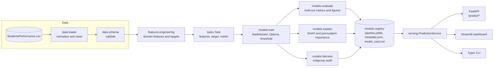

# EduPulse architecture

## 1. Design goals

| Goal | How |
|---|---|
| One source of truth | All logic is in the installable `edupulse` package. Notebooks, CLI, API and dashboard only call it. |
| Reproducibility | Fixed seeds, a declared schema, a fixed CV protocol, and the data hash plus environment recorded in every artefact. |
| Extensibility | A new prediction problem is a new `Task` entry; a new algorithm is a new `Candidate` in the zoo. Nothing else changes. |
| Honest evaluation | Repeated stratified CV for model selection, an untouched hold-out for reporting, and leakage documented where it exists. |
| Operational readiness | Versioned model registry, model cards, a FastAPI service with input validation, a Docker image, and CI. |

## 2. Component diagram



## 3. Package layout

```
src/edupulse/
  config.py            Pydantic settings (overridable from the environment), paths, domain cut-offs
  tasks.py             task registry: at_risk, math_score, performance_level
  pipeline.py          run_pipeline(), the single end-to-end entry point
  serving.py           PredictionService shared by CLI, API and dashboard
  eda.py               automated EDA profile and figures
  cli.py               the `edupulse` command-line interface (Typer)
  data/
    loader.py          CSV ingestion, column normalisation, cleaning
    schema.py          declarative schema and validator (no extra dependencies)
  features/
    engineering.py     engineer_features(), FeatureEngineer (sklearn transformer), build_preprocessor()
  models/
    zoo.py             candidate estimators and their Optuna search spaces
    train.py           CV leaderboard, tuning, threshold selection, final fit
    evaluate.py        metrics and ROC, PR, calibration, threshold and regression plots
    explain.py         SHAP (tree, linear and kernel explainers) with one-hot aggregation
    fairness.py        subgroup metrics, parity gaps, disparate-impact ratio
    registry.py        versioned artefact store and model-card renderer
```

## 4. The inference pipeline object

Every persisted model is a single `sklearn.pipeline.Pipeline`:

```
FeatureEngineer(keep=task.features)   raw row -> engineered frame with only the legal columns
ColumnTransformer                      one-hot for nominal columns, ordinal for parental education, scaling for numeric
Estimator                              the tuned model
```

Because pre-processing is inside the pipeline, the API accepts raw, human-readable JSON and there is no train/serve skew. Unknown categories are ignored at inference rather than crashing it.

## 5. Training protocol

1. Split. 80/20 stratified hold-out with seed 42. The test split is not touched until final reporting.
2. Leaderboard. Every candidate is scored with `RepeatedStratifiedKFold(5 x 2)` (`RepeatedKFold` for regression) on the training split. Mean and standard deviation of the primary metric and all secondary metrics are recorded.
3. Tuning. The best non-baseline family is tuned with Optuna (TPE sampler, median pruner, per-fold pruning reports). If tuning does not beat the defaults, the defaults are kept.
4. Threshold (binary tasks only). Out-of-fold probabilities from a fresh 5-fold CV pick the highest threshold that still reaches the configured target recall (default 80%).
5. Final fit on the full training split. Hold-out metrics, figures, SHAP values, permutation importance and the fairness audit are computed on the test split only.
6. Register. Artefacts are written to `models/<task>/<version>/` and `latest.json` is updated.

## 6. Why three tasks

| Task | Kind | Inputs | Purpose |
|---|---|---|---|
| `at_risk` | binary | background only | The realistic early-warning problem and the main task. A modest AUC is expected because the inputs are weak proxies. |
| `math_score` | regression | background + reading + writing | Cross-subject prediction with strong signal (R² about 0.88). Exercises the regression path. |
| `performance_level` | 3-class | background + all scores | The original coursework task, kept as a leakage case study: the label is a function of the inputs. |

## 7. Serving

`PredictionService` loads the latest version of each task on first use, validates rows against the schema, and returns probabilities, risk bands (low, moderate, high, critical) and optional SHAP contributions.

FastAPI wraps it with typed request models (`Literal` enums for every categorical field), CORS, a timing header, a batch endpoint capped at 1,000 rows, and 422/503 error mapping.

The Streamlit dashboard uses the same service in-process (no HTTP hop) for EDA, leaderboards, live prediction, explanations, fairness and model cards.

## 8. Quality gates

- `pytest`: 41 tests covering schema, features, tasks, the zoo, thresholding, explainers, fairness, registry round-trip, the end-to-end pipeline and the REST API (through `TestClient`).
- `ruff`: lint and format.
- GitHub Actions: lint, then the test matrix (Ubuntu and Windows, Python 3.11 and 3.12), then a fast training run with an API curl smoke test, then a Docker build.
